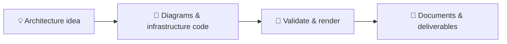

<p align="center">
  
</p>

<p align="center">
  <strong>From architecture sketch to infrastructure code to polished deliverable.</strong><br />
  One Azure-focused development environment. Your tools, ready together.
</p>

<p align="center">
  
  
  
  
</p>

<p align="center">
  <a href="#-quick-start">Quick start</a> ·
  <a href="#-the-toolbox">The toolbox</a> ·
  <a href="#-build-something">Build something</a> ·
  <a href="#-under-the-hood">Under the hood</a>
</p>

---

## ✨ Built for the architect's workflow

I'm Jonathan, a Microsoft Azure Infrastructure Architect. This is my personal toolkit for turning ideas into diagrams, infrastructure and documents—with less environment setup between each step.

| Design | Automate | Deliver |
| :--- | :--- | :--- |
| Python Diagrams and Graphviz for architecture as code | Azure CLI, PowerShell/Az and Bicep for Azure workflows | Pandoc for Markdown-to-HTML and DOCX conversion |
| Mermaid for diagrams alongside your documentation | Terraform, Terragrunt and TFLint for infrastructure development | Separate Playwright and Puppeteer browsers for high-fidelity rendering |
| SVG and PNG output, with fonts and image tooling included | Checkov and Trivy for local configuration checks | Markdown linting and VS Code previews for the finishing touches |



> [!IMPORTANT]
> **Azure Linux 4 is a preview image for evaluation/testing, not production.** Native ARM64 builds, workflows and VS Code editor checks have passed, including user-confirmed editor acceptance. Native x64 acceptance remains pending. Playwright works in our ARM64 checks but does not officially support Azure Linux.

## 🚀 Quick start

Install Docker and VS Code with the **Dev Containers** extension, then:

1. Clone this repository and open its folder in VS Code.
2. Run **Dev Containers: Rebuild and Reopen in Container**. Post-create checks the complete toolkit automatically.
3. Create your work in local folders such as `diagrams/`, `azure/` and `conversions/`.

> [!NOTE]
> Package installs use Microsoft's approved **CFS proxy**. Your network must be able to reach `packagefeedproxy.microsoft.io` and its returned artifact endpoints, plus the image registry and upstream binary/browser/module download services.

### Check your environment

Run in the container:

```bash
# Full automated workflows, including sandboxed browser rendering
bash /opt/csa-toolkit/smoke-test.sh

# Guided editor acceptance, from VS Code's integrated container terminal
bash .devcontainer/test-editor.sh
```

The editor script guides you through extension activation, language tooling, previews, MCP and workspace/cache checks. Type `PASS` only after exercising each group; anything else fails acceptance. It records your confirmations, not automated proof of extension activation or native hardware. Repeat on each native architecture.

`smoke-test.sh --without-browsers` is partial diagnostics only. No acceptance check requires cloud deployment or credential sharing.

## 🧰 The toolbox

| Area | Included tools |
| :--- | :--- |
| **Azure** | Azure CLI, standalone Bicep, PowerShell 7.6; Az.Accounts, Resources, Storage, Network, KeyVault and Websites |
| **Infrastructure** | Terraform, Terragrunt, TFLint, Checkov and Trivy |
| **Python** | uv-managed Python 3.14, Diagrams, matplotlib and Pillow |
| **JavaScript** | Node 24 LTS, nvm, npm, Yarn, pnpm, Corepack and native build tools |
| **Publishing** | Pandoc, Mermaid CLI, markdownlint-cli2, Graphviz, SVG conversion and Liberation fonts |
| **Browsers** | Playwright Chromium and a separate Puppeteer/Mermaid Chrome installation |
| **Developer experience** | GitHub CLI, Bash/Zsh, VS Code extensions and Microsoft Learn MCP configuration |

Root workspace `package.json` dependencies are installed at post-create. A root `requirements.txt` gets its own workspace `.venv`; select that interpreter for those scripts. The prebuilt toolkit environment stays separate.

## 🎨 Build something

<details open>
<summary><strong>Architecture as code → SVG and PNG</strong></summary>

Save this as `diagrams/azure_architecture.py`:

```python
from pathlib import Path

from diagrams import Cluster, Diagram
from diagrams.azure.compute import AppServices
from diagrams.azure.database import SQLDatabases
from diagrams.azure.network import ApplicationGateway

output = Path(__file__).with_name("azure_architecture")
with Diagram("Azure workload", filename=str(output), outformat=["svg", "png"], show=False):
    gateway = ApplicationGateway("Ingress")
    with Cluster("Application"):
        app = AppServices("Web app")
        database = SQLDatabases("Data")
    gateway >> app >> database
```

Run `python diagrams/azure_architecture.py`. Both outputs land beside the script.

</details>

<details>
<summary><strong>Markdown + Mermaid → shareable documents</strong></summary>

Render a diagram, reference its image in your Markdown, then convert:

```bash
mmdc -i conversions/architecture.mmd -o conversions/architecture.png
pandoc conversions/report.md --resource-path=conversions -o conversions/report.docx
pandoc conversions/report.md --resource-path=conversions --standalone -o conversions/report.html
```

Custom templates, CSS and Lua filters can extend your publishing workflow. They are local project content, not a preinstalled publishing engine.

</details>

## ⚙️ Under the hood

Only the foundational configuration is tracked. Your diagrams, scripts and generated documents are intentionally ignored; change `.gitignore` if you want to publish them.

The `.devcontainer` files are the build contract, not leftover migration artifacts:

| Files | Why they stay |
| :--- | :--- |
| `devcontainer.json`, `Dockerfile`, `post-create.sh` | Editor integration, native DNF5 provisioning and workspace initialization |
| `install-tools.sh`, `install-az-modules.ps1` | Architecture-specific binary installs and all-users Az modules |
| `tool-versions.env`, `releases.sha256` | Reviewed binary versions and verified downloads |
| `pyproject.toml`, `uv.lock`, `package.json`, `package-lock.json`, `.npmrc` | Declared language dependencies, integrity locks and CFS resolution cutoff |
| `devcontainer-lock.json` | Pinned common-utils Feature |
| `chromium-seccomp.json`, `LICENSE.seccomp` | Approved sandbox policy and its upstream license |
| `smoke-test.sh`, `smoke-test.py`, `smoke-browser.cjs`, `test-editor.sh` | Real workflow checks and guided editor acceptance |
| `check-package-age.py` | Publication-age audit for locked direct/transitive packages |

<details>
<summary><strong>Package policy and reviewed updates</strong></summary>

Use the newest CFS-available **stable releases older than seven days**, not unrestricted public `latest`. The current UTC cutoff in `.npmrc` is `2026-10-01T13:05:02Z`; Playwright is `1.63.0`, pnpm `12.8.2`, and Checkov `3.3.22`. All locked transitive versions are audited too.

Updates are reviewed rebuilds, not in-place global upgrades:

1. Update the cutoff and select eligible stable pins. Review image/runtime versions, binary checksums, Azure CLI RPM and browser revisions together.
2. Regenerate Python locks with `uv lock --project .devcontainer --upgrade --default-index https://packagefeedproxy.microsoft.io/pypi/simple/`. Review age constraints such as aiohttp in `pyproject.toml`.
3. Resolve npm from a fresh lock in a temporary directory containing `package.json` and `.npmrc`: run `npm install --package-lock-only --ignore-scripts`, then copy the reviewed lock back. Existing locks can retain too-recent transitive versions.
4. Run `uv run --no-project .devcontainer/check-package-age.py`, rebuild through Dev Containers, and repeat automated/editor checks on native ARM64 and x64.

npm/pnpm/Yarn/Corepack use `https://packagefeedproxy.microsoft.io/npm/`; uv uses `https://packagefeedproxy.microsoft.io/pypi/simple/`. Python installs with proxy-native `uv sync --locked` and verified artifact hashes; npm retains lock integrity. CFS's PyPI timestamps can reflect ingestion rather than publication, so the age audit reads upstream PyPI **metadata only**, never package downloads.

Azure Artifacts `ms-feed-*` pages are for browsing, not package-manager configuration. URLs returned by CFS may legitimately reference Azure Artifacts storage. Do not bypass CFS, disable TLS verification or adopt prereleases to unblock installs. Workspace projects retain their own dependency declarations.

Yarn comes from locked `@yarnpkg/cli-dist` because Corepack's version-metadata endpoint returns 404 through CFS; Corepack remains available. PowerShell Gallery installation uses build-scoped HTTP/1 to avoid the network's HTTP/2 TLS EOF failures, without weakening certificate verification.

Image/application pins are not a fully immutable OS snapshot: native repositories and transitive Az dependencies can change.

</details>

<details>
<summary><strong>Browser isolation, mounts and acceptance boundaries</strong></summary>

Playwright uses an unsupported-OS Ubuntu fallback with native libraries installed through DNF. Puppeteer/Mermaid retains its own matched Chrome/cache. Browser checks keep sandboxing enabled.

The approved seccomp profile adds only `clone`, `setns` and `unshare` permissions to [Moby's default profile at 6fe7deb](https://github.com/moby/profiles/blob/6fe7deb1b9fb7c0397a4593480d7d22b9ee8caef/seccomp/default.json), following [Playwright's Docker guidance](https://playwright.dev/docs/docker). Its Apache-2.0 license is retained in `.devcontainer/LICENSE.seccomp`. No `--no-sandbox`, privileged/unconfined mode or extra capabilities are enabled. Review the policy against Docker defaults when upgrading the runtime.

The container preserves the host `.azure` bind and named GitHub/uv caches. Environment overrides share standalone Bicep and disable CLI auto-upgrades without explicitly overwriting those host configuration settings; Azure CLI may persist its own defaults.

Native ARM64 real builds, sandboxed workflows, fresh/stale cache lifecycle checks and user-confirmed editor acceptance pass. **Native x64 remains unverified**; emulation and release assets are not substitutes.

npm advisories remain in the eligible graph. Workflow success is not vulnerability-free certification. Trivy's smoke fixture uses embedded local configuration checks; vulnerability-database coverage is separate.

</details>

References: [Azure Linux images and preview boundaries](https://learn.microsoft.com/en-us/azure/azure-linux/container-images-overview) · [Native repositories](https://learn.microsoft.com/en-us/azure/azure-linux/package-repositories) · [Playwright OS requirements](https://playwright.dev/docs/intro#system-requirements) · [Puppeteer troubleshooting](https://pptr.dev/troubleshooting)

---

<p align="center">
  <strong>Design with intent. Automate with confidence. Deliver with clarity.</strong><br />
  <sub>A personal toolkit by Jonathan Vella. Not an official Microsoft product.</sub>
</p>
